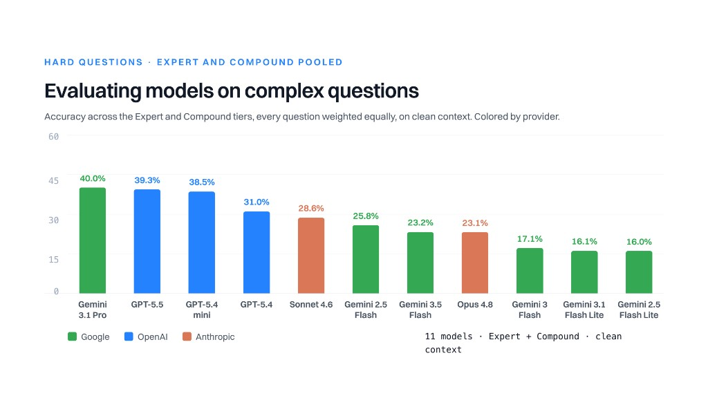

# Long-Context LLM Evaluation Experiments (`mlcr`)

A config-driven framework for evaluating how well LLMs preserve accuracy when
real document context is diluted with unrelated filler material. It sweeps
experiments across a full matrix of **cases × prompts × models × modalities ×
filler ratios × thinking levels**, with deterministic filler-context insertion.

The intended use case is medical-record / OCR evaluation, but nothing here is
domain-specific — any task that fits the `(prompt + supporting summaries + supporting images)`
shape will work.



## 🔥 Updates

- **[2026/06/18]** We are excited to release MLCR, a new benchmark for evaluating how well LLMs reason over long, complex medical claim files.

---

## Table of contents

1. [Quick overview](#quick-overview)
2. [Project components](#project-components)
3. [Data setup (Hugging Face)](#data-setup-hugging-face)
4. [Installation](#installation)
5. [Quickstart](#quickstart)
6. [Core mechanics](#core-mechanics)
   - [Test matrix](#test-matrix)
   - [Filler insertion](#filler-insertion)
   - [Thinking levels](#thinking-levels)
   - [Scoring (LLM-as-a-Judge)](#scoring-llm-as-a-judge)
   - [Determinism guarantees](#determinism-guarantees)
   - [Resumability](#resumability)
7. [CLI reference](#cli-reference)
8. [Configuration](#configuration)
   - [Model configs](#model-configs)
   - [Experiment configs](#experiment-configs)
9. [Output structure](#output-structure)
10. [Providers](#providers)
11. [Adding a new provider](#adding-a-new-provider)
12. [Sub-READMEs](#sub-readmes)
13. [Troubleshooting](#troubleshooting)

---

## Quick overview

Given an experiment config, `mlcr`:

1. Builds a Cartesian test matrix of every combination you want to evaluate
2. For each cell, deterministically interleaves unrelated "filler" documents among the real ones
3. Calls the LLM provider with the constructed context + question
4. Writes structured results per cell plus summary files for the whole sweep
5. Optionally scores responses against ground-truth answers using a 3-model majority-vote LLM judge

---

## Project components

The repository is organized into several distinct components, each with a
specific purpose. Sub-READMEs exist in key directories for deeper documentation
(see [Sub-READMEs](#sub-readmes)).

| Component | Path | Purpose | When to use |
|-----------|------|---------|-------------|
| **Runner** | `src/mlcr/` | Core evaluation engine — builds test matrices, manages filler interleaving, calls providers, writes results | Running experiments against LLMs |
| **Scorer** | `src/mlcr/scoring.py` | Multi-gate LLM-as-a-Judge evaluation pipeline | Grading model responses against ground-truth answers after a run completes |
| **Model Configs** | `configs/models/` | YAML definitions for each model variant (provider, temperature, tokens) | Adding or tweaking model definitions |
| **Experiment Configs** | `configs/experiments/` | YAML specs defining full experiment sweeps | Designing and running new experiments |
| **Mock Data Generation** | `mock_data_generation/` | AI-powered tool for generating realistic fake-filled form images for the filler pool | Expanding the filler pool with new form types or variants |
| **Cases** | `cases/` | Evaluation units — documents + questions + ground-truth answers | Adding new evaluation scenarios |
| **Filler Files** | `filler_files/` | Pools of unrelated documents used to dilute real context | Understanding or expanding the noise material |
### Repository layout

```
long-context-evaluation-experiments/
├── README.md                       ← you are here
├── pyproject.toml
├── cases/                          ← REQUIRES HUGGING FACE INIT (git-ignored)
│   └── <case_uuid>/
│       ├── prompts/                # one .txt per question
│       ├── summaries/              # OCR text for this case
│       ├── images/                 # source images for this case
│       ├── answers/                # ground-truth answers per prompt
│       └── difficulties.csv        # optional difficulty annotations
├── filler_files/                   ← REQUIRES HUGGING FACE INIT (git-ignored)
│   ├── empty/images/               # blank form templates (source for generation)
│   ├── image_gen_1variant/         # 131 filled form pages (1 variant each)
│   │   ├── images/
│   │   └── ocr/
│   └── image_gen_3variants/        # 393 filled form pages (3 variants each)
│       └── images/
├── configs/
│   ├── experiments/                # experiment YAMLs (has its own README)
│   │   └── smoke.yaml
│   └── models/                     # model YAMLs (has its own README)
│       ├── gemini-2.5-flash.yaml
│       ├── claude-opus-4-8-gcp.yaml
│       ├── gpt-5.5.yaml
│       └── ...
├── src/mlcr/                       # the Python package
│   ├── cli.py                      # entry point
│   ├── config.py                   # Pydantic schemas + validation
│   ├── cases.py                    # case + filler discovery
│   ├── filler.py                   # deterministic interleaving algorithm
│   ├── matrix.py                   # Cartesian product → row list
│   ├── runner.py                   # ThreadPool execution engine
│   ├── scoring.py                  # LLM-as-a-Judge scorer
│   ├── thinking.py                 # thinking level abstraction
│   └── providers/
│       ├── base.py                 # Provider ABC + ChatRequest/Response
│       ├── registry.py             # name → provider factory
│       ├── google_provider.py      # Gemini via Vertex AI
│       ├── anthropic_gcp_provider.py  # Claude via GCP
│       └── azure_openai_provider.py   # GPT via Azure OpenAI
├── mock_data_generation/           # filler generation tooling (has its own README)
│   └── ai_form_filler.py
└── runs/                           # experiment outputs (git-ignored)
```

---

## Data setup (Hugging Face)

The `cases/` and `filler_files/` directories are **git-ignored** and must be
initialized separately. The dataset is hosted on Hugging Face at
[`Wisedocs/mlcr-dataset`](https://huggingface.co/datasets/Wisedocs/mlcr-dataset)
and can be downloaded using the built-in CLI.

### Prerequisites

You must be authenticated with Hugging Face:

```bash
hf auth login
```

### Download and reconstruct for the harness

The simplest way to get started is to download the dataset and reconstruct the
directory structure the harness expects in one step:

```bash
mlcr download --prepare-for-harness --output-dir .
```

This downloads three dataset configs from Hugging Face (`questions`,
`cases_summaries`, `filler_files`) and writes them out as the file tree the
runner expects:

```
<output-dir>/
├── cases/
│   └── <uuid>/
│       ├── prompts/q01.txt, q02.txt, ...
│       ├── answers/a01.txt, a02.txt, ...
│       ├── summaries/001.txt, 002.txt, ...
│       └── difficulties.csv
└── filler_files/
    ├── empty/ocr/*.txt
    └── image_gen_1variant/ocr/*.txt
```

If you download to a directory other than the repo root, point the runner at it:

```bash
mlcr download --prepare-for-harness --output-dir ./experiment_data
mlcr run configs/experiments/smoke.yaml --repo-root ./experiment_data
```

### Download raw parquets only

If you just want the raw parquet files (e.g. for analysis):

```bash
mlcr download --output-dir ./data
```

This saves `questions.parquet`, `cases_summaries.parquet`, and
`filler_files.parquet` without reconstructing the directory tree.

### Loading the dataset directly in Python

You can also load the dataset programmatically without the CLI:

```python
from datasets import load_dataset

# Load a specific config
questions = load_dataset("Wisedocs/mlcr-dataset", "questions", split="train")
summaries = load_dataset("Wisedocs/mlcr-dataset", "cases_summaries", split="train")
fillers = load_dataset("Wisedocs/mlcr-dataset", "filler_files", split="train")
```

### What you get after initialization

- **`cases/`** — 10 case directories, each with prompts (Tier 1–3 difficulty),
  summaries, answers, and difficulty annotations
- **`filler_files/empty/ocr/`** — 131 OCR text files from blank form templates
- **`filler_files/image_gen_1variant/ocr/`** — 131 OCR text files from AI-generated filled forms

> **Note:** Images are not included in the dataset. The download provides
> text-only data, which is sufficient for `modalities: [text]` experiments.

Without these directories populated, the runner will fail at config validation
time with errors like `case directory missing` or empty filler pool warnings.

---

## Installation

Requires **Python 3.11+**.

```bash
python3 -m venv .venv
source .venv/bin/activate

# Core install
pip install -e .

# Add provider SDKs you need:
pip install -e ".[google]"      # Gemini via Vertex AI
pip install -e ".[anthropic]"   # Claude via GCP
pip install -e ".[azure]"       # GPT via Azure OpenAI
pip install -e ".[all]"         # all providers
pip install -e ".[dev]"         # adds pytest
```

### Credentials

Credentials are loaded from a `.env` file at the repo root:

```bash
cp .env.example .env
# then edit .env
```

| Provider | Variable | Notes |
|----------|----------|-------|
| Google / Vertex (Gemini) | `GOOGLE_CLOUD_PROJECT` | GCP project id |
| Google / Vertex (Gemini) | `GOOGLE_APPLICATION_CREDENTIALS` | Path to service-account JSON |
| Google / Vertex (Gemini) | `GOOGLE_CLOUD_LOCATION` *(optional)* | Defaults to `us-central1` |
| Anthropic via GCP (Claude) | `GOOGLE_CLOUD_PROJECT` | GCP project id |
| Anthropic via GCP (Claude) | `GOOGLE_APPLICATION_CREDENTIALS` | Path to service-account JSON |
| Anthropic via GCP (Claude) | `ANTHROPIC_GCP_REGION` | GCP region for Claude |
| Azure OpenAI (GPT) | `AZURE_OPENAI_API_KEY` | API key |
| Azure OpenAI (GPT) | `AZURE_OPENAI_ENDPOINT` | Endpoint URL |

---

## Quickstart

```bash
# 1. Inspect the matrix that would run (no API calls)
python -m mlcr plan configs/experiments/smoke.yaml

# 2. Build all contexts without calling providers (writes prompt.txt per row)
python -m mlcr run configs/experiments/smoke.yaml --dry-run

# 3. Execute the full experiment
python -m mlcr run configs/experiments/smoke.yaml

# 4. Score results against ground-truth answers
python -m mlcr score runs/<experiment_uuid>
```

Each run prints a JSON summary including the `experiment_uuid` and `run_dir`.
Inspect `runs/<uuid>/summary.csv` for the tabular view.

---

## Core mechanics

### Test matrix

The runner builds a Cartesian product of all experiment dimensions:

```
cases × prompts × models × modalities × filler_ratios × thinking_levels × repetitions
```

Each cell gets a deterministic `row_id` = `blake2b(case|prompt|model|modality|ratio|thinking|filler_subdir=…)`.
When `repetition > 0`, `|rep=N` is appended before hashing.
This id is both the result-directory name and the resume key.

For example, an experiment with 2 cases (5 prompts each), 3 models, 2 modalities,
3 filler ratios, and 2 thinking levels produces: `2×5×3×2×3×2 = 360` matrix cells,
each becoming one API call.

### Filler insertion

Filler insertion is **deterministic given the seed, case, and ratio**. It tests whether
models can still answer correctly when real documents are buried in noise.

**How it works:**
- `junk_context_ratio` controls the filler-to-real ratio. `0` = no filler,
  `1` = equal filler and real, `2` = twice as much filler as real content.
- A per-case-ratio RNG is derived from `blake2b(seed:case_uuid|ratio)` — all rows
  sharing the same case and ratio get identical filler, so results are directly
  comparable across models, modalities, and prompts. Different cases or ratios
  get different filler picks.
- `N_filler = round(N_real_pages × ratio)` filler pages are sampled and
  interleaved at random positions among the real pages. Text and image
  channels use the same page indices and insertion positions, so results are
  directly comparable across modalities.
- Sampling is WITH replacement, so any ratio is achievable regardless of pool size.

Every `result.json` records exactly which filler files were used and where they
were inserted, making results fully reproducible.

### Thinking levels

The `thinking` dimension controls how much reasoning budget models get. Available
levels: `none`, `minimal`, `low`, `medium`, `high`.

Each level maps to provider-native representations at call time:

| Level | Google (Gemini 3.x) | Google (Gemini 2.x budget) | Anthropic (Claude) | Azure OpenAI (GPT) |
|-------|--------------------|-----------------------------|-------------------|-------------------|
| `none` | Thinking disabled | Budget: 0 | No extended thinking | No reasoning effort |
| `minimal` | `THINKING_LEVEL_MINIMAL` | Budget: 0 | Effort: `minimal` | Effort: `minimal` |
| `low` | `THINKING_LEVEL_LOW` | Budget: 4096 | Effort: `low` | Effort: `low` |
| `medium` | `THINKING_LEVEL_MEDIUM` | Budget: 16384 | Effort: `medium` | Effort: `medium` |
| `high` | `THINKING_LEVEL_HIGH` | Budget: 32768 | Effort: `high` | Effort: `high` |

Gemini 2.x models (`gemini-2.5-flash`, `gemini-2.5-flash-lite`, `gemini-2.0*`) use a
token-budget API. Gemini 3.x models use the `thinking_level` string directly.

Thinking is an experiment-level dimension (not per-model-config), so a single
model definition can be swept across multiple thinking budgets.

### Scoring (LLM-as-a-Judge)

After a run completes, `mlcr score` evaluates responses against ground-truth:

1. **Gate 0 (free)** — Conciseness check: response char count ≤ 3× reference length
2. **Gate 1 (LLM)** — Completeness + Accuracy: each response is judged by 3 models
   (`gemini-3.1-pro-preview`, `claude-opus-4-8-gcp`, `gpt-5.5`) and passes by majority vote

The scorer writes `results_scoring.csv` with judge columns (`judge_concise`,
`judge_complete`, `judge_accurate`, `judge_correct`, `judge_votes`, `judge_rationales`).

```bash
# Score a completed run
python -m mlcr score runs/<experiment_uuid>

# Or use the standalone entry point
mlcr-score runs/<experiment_uuid>
```

### Determinism guarantees

- All randomness flows through `blake2b(seed:row_id)` — no global RNG state.
- File enumerations are sorted before sampling.
- `row_id` is a stable hash of all matrix dimensions, independent of iteration order.
- Given identical inputs (cases, filler pool, configs, seed), two runs produce
  bit-identical contexts for every row.
- Provider responses are non-deterministic unless `temperature: 0` — that's
  outside the runner's control.

### Resumability

A row is "done" when its `result.json` exists with `status == "ok"`. The runner
skips these when pointed at an existing `run_dir`.

The default CLI mints a fresh UUID per invocation (clean run directory). To resume:

```python
from mlcr.config import load_experiment
from mlcr.runner import Runner

cfg = load_experiment("configs/experiments/foo.yaml")
Runner(cfg, experiment_uuid="<existing-uuid>", run_dir="runs/<existing-uuid>").run()
```

Failed (`status="error"`) rows are retried on subsequent runs against the same directory.

---

## CLI reference

```
python -m mlcr plan      <experiment.yaml>            # print matrix, no calls
python -m mlcr run       <experiment.yaml> [flags]    # execute the matrix
python -m mlcr download  [flags]                      # download dataset from HF
python -m mlcr summarize <run_dir>                    # rebuild summary.csv
python -m mlcr score     <run_dir>                    # LLM-as-a-Judge scoring
```

### Flags for `download`

| Flag | Meaning |
|------|---------|
| `--output-dir PATH` | Directory to write downloaded data (default: current dir) |
| `--prepare-for-harness` | Reconstruct `cases/` and `filler_files/` directory structure |

### Flags for `run`

| Flag | Meaning |
|------|---------|
| `--force` | Re-run all rows, overwriting existing results |
| `--dry-run` | Build contexts, write `prompt.txt`/`images.json`, skip provider calls |
| `--limit N` | Only execute the first N rows (for sanity checks) |
| `--repo-root PATH` | Override the inferred repo root |
| `--resume UUID` | Resume an existing run: reuse its directory and skip completed rows |
| `--no-previous-runs` | Disable reuse of results from prior experiments with matching identity |

### Entry point scripts

These are also available as standalone commands after `pip install -e .`:

| Command | Equivalent |
|---------|-----------|
| `mlcr` | `python -m mlcr` |
| `mlcr-score` | `python -m mlcr.scoring` |
| `mlcr-backfill` | `python -m mlcr.backfill` |

---

## Configuration

All configs are YAML. See the sub-READMEs in `configs/models/` and
`configs/experiments/` for full schema documentation.

### Model configs

Each file in `configs/models/<id>.yaml` describes one model. The filename stem
must equal the `id` field.

```yaml
id: gemini-3.5-flash-preview
provider: google
model: gemini-3.5-flash-preview
max_output_tokens: 16384
temperature: 0.0
extra:
  top_p: 1.0
```

Available providers: `google`, `anthropic_gcp`, `azure_openai`.

### Experiment configs

Define what to sweep across. Full schema documented in `configs/experiments/README.md`.

```yaml
name: long_context_pilot
models:
  - gemini-3.5-flash-preview
  - claude-opus-4-8-gcp
  - gpt-5.5
cases:
  - 3fa85f64-5717-4562-b3fc-2c963f66afa6
modalities: [text, image, both]
junk_context_ratio: [0, 0.5, 1, 2]
thinking:
  default: [minimal]
  overrides:
    claude-opus-4-8-gcp: [low]
allowed_filler_forms: [cms-10106, ab-vehicle-inspection-report]
filler_subdir: image_gen_1variant
seed: 42
concurrency:
  max_workers: 32
retry:
  max_attempts: 5
  initial_backoff_s: 2.0
  max_backoff_s: 120.0
```

---

## Output structure

Each run creates `runs/<experiment_uuid>/` containing:

| File | Description |
|------|-------------|
| `run.json` | Frozen experiment config + matrix size |
| `config.yaml` | Copy of the experiment config used for this run |
| `summary.jsonl` | One JSON object per matrix cell |
| `summary.csv` | Flat CSV mirror of the JSONL |
| `responses.csv` | All responses with metadata (model, case, prompt, etc.) |
| `matrix.txt` | Every planned row with its `row_id` |
| `logs/runner.log` | Execution log |
| `results/<row_id>/result.json` | Full per-row record (question, answer, metadata) |
| `results/<row_id>/prompt.txt` | Exact text payload sent to the model |
| `results/<row_id>/images.json` | Ordered image paths sent to the model |

After scoring, additional files appear:

| File | Description |
|------|-------------|
| `results_scoring.csv` | Responses + judge columns |
| `aggregate_summary.csv` | Aggregated pass rates by model/modality/ratio |
| `aggregate_summary_by_difficulty.csv` | Breakdown by difficulty tier |

---

## Providers

The provider layer is a thin abstraction over LLM APIs:

| Provider ID | API | Module |
|-------------|-----|--------|
| `google` | Gemini via Vertex AI | `providers/google_provider.py` |
| `anthropic_gcp` | Claude via GCP | `providers/anthropic_gcp_provider.py` |
| `azure_openai` | GPT via Azure OpenAI | `providers/azure_openai_provider.py` |

Each provider:
- Constructs its client lazily from environment variables
- Maps SDK errors to `TransientProviderError` (retryable) or `PermanentProviderError` (not retryable)
- Reports `usage` with `prompt_tokens`, `completion_tokens`, and `thinking_tokens`

The runner contains no provider-specific logic — it only calls `registry.get(name).call(req)`.

---

## Adding a new provider

1. Create `src/mlcr/providers/<name>_provider.py` implementing `Provider.call(req) -> ChatResponse`
2. Map `req.user_text`, `req.images`, `req.model_cfg.thinking`, and `req.model_cfg.extra` to the SDK
3. Raise `TransientProviderError` for retryable failures, `PermanentProviderError` otherwise
4. Register in `providers/registry.py::_load_builtins()` (one line)
5. Reference from model configs: `provider: <name>`

---

## Sub-READMEs

Detailed documentation lives alongside the components it describes:

| Path | What it covers |
|------|---------------|
| [`configs/experiments/README.md`](configs/experiments/README.md) | Full experiment config schema — all fields, types, defaults, validation rules, and thinking override syntax |
| [`configs/models/README.md`](configs/models/README.md) | Model config schema, provider table, environment variables, and examples for each provider |
| [`mock_data_generation/README.md`](mock_data_generation/README.md) | AI form-filler tool — 3-phase workflow, CLI options, keyboard shortcuts, and how generated filler integrates with the evaluation framework |

---